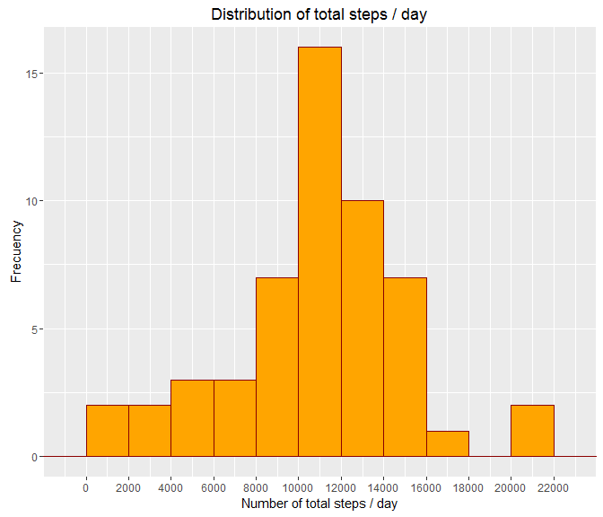
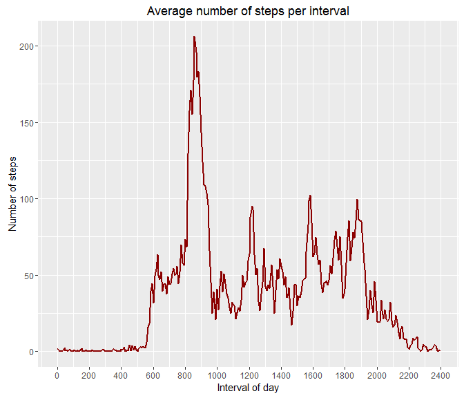
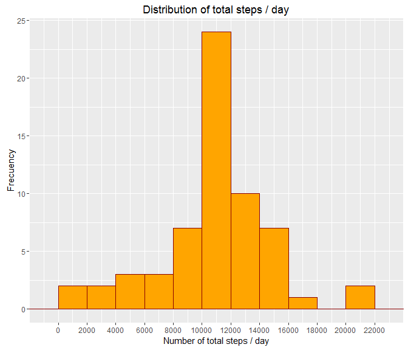
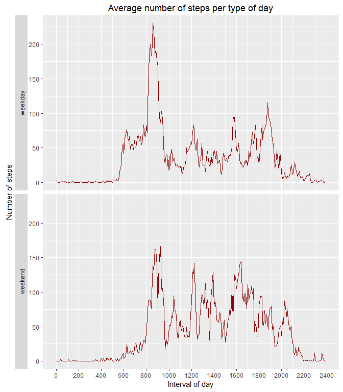

# Reproducible Research: Peer Assessment 1
Enrique Bertrand  
February, 3, 2016  

This report analyzes the dataset `activity` and documents the answer of some questions about its variables. The dataset `activity` includes the number of steps taken in 5 minute intervals each day from a personal activity monitoring device. The data consists of two months of data from an anonymous individual collected during the months of October and November, 2012.

In order to reproduce the analysis, package `ggplot2` must be installed and loaded. If not, execution will be stopped.


```r
# Cheking if "ggplot2" is installed and loading it
resp <- require("ggplot2", quietly = TRUE)

if (!resp) {
  stop("Please, install 'ggplot2' package before running this script")
}
```


## Loading and preprocessing the data

The raw file `activity.csv` has been obtained, first downloading this zip file <https://d396qusza40orc.cloudfront.net/repdata%2Fdata%2Factivity.zip>, and then unzipping it. It must be available in the same directory where this script is running.

The file is read and loaded in the data.frame `activity`:


```r
# Cheking if the activity raw data file exist
if (!file.exists("activity.csv")) {
  stop("'activity.csv' file must exist in this directory before running the script")
}

# Reading the file and creating "activity" data.frame
activity <- read.csv("activity.csv", stringsAsFactors=FALSE)

# Showing basic data of "activity" data.frame
head(activity, 5)
```

```
##   steps       date interval
## 1    NA 2012-10-01        0
## 2    NA 2012-10-01        5
## 3    NA 2012-10-01       10
## 4    NA 2012-10-01       15
## 5    NA 2012-10-01       20
```

```r
str(activity)
```

```
## 'data.frame':	17568 obs. of  3 variables:
##  $ steps   : int  NA NA NA NA NA NA NA NA NA NA ...
##  $ date    : chr  "2012-10-01" "2012-10-01" "2012-10-01" "2012-10-01" ...
##  $ interval: int  0 5 10 15 20 25 30 35 40 45 ...
```

Before the data can be processed some cleaning steps must be done:

* Column `activity$date` should be formatted as Date.

* Intervals in column `activity$interval` are not really well shaped. Hours and minutes are put together and, as a consequence, there are "jumps" in the time axis. For instance, they jump from `155` to `200` or from `1055` to `1100`. As plots could be slighty distorted (although it is not always noticeable given the size of the plots), minutes should be transformed in fractions of hour.

Let's do this cleaning:


```r
# Converting date column format from character to Date
activity$date <- as.Date(activity$date)

# Extracting minutes and hours from an interval
minutes_interv <- as.integer(with(activity, 
                                  substring(interval, 
                                            nchar(interval) - 1, 
                                            nchar(interval))))
hours_interv <- as.integer(with(activity, 
                                substring(interval, 
                                          1, 
                                          nchar(interval) - 2)))

# hour_interv for hour 0 appears as NA; assingning the right hour
hours_interv[is.na(hours_interv)] <- 0

# Creating a "normalized" interval column with minutes as a fraction of hour  
activity$interval_norm <- as.integer(round((hours_interv + minutes_interv / 60) * 100))

# Showing basic data of cleaned "activity" data.frame
head(activity, 5)
```

```
##   steps       date interval interval_norm
## 1    NA 2012-10-01        0             0
## 2    NA 2012-10-01        5             8
## 3    NA 2012-10-01       10            17
## 4    NA 2012-10-01       15            25
## 5    NA 2012-10-01       20            33
```

```r
str(activity)
```

```
## 'data.frame':	17568 obs. of  4 variables:
##  $ steps        : int  NA NA NA NA NA NA NA NA NA NA ...
##  $ date         : Date, format: "2012-10-01" "2012-10-01" ...
##  $ interval     : int  0 5 10 15 20 25 30 35 40 45 ...
##  $ interval_norm: int  0 8 17 25 33 42 50 58 67 75 ...
```


## What is mean total number of steps taken per day?

The following histogram shows the distribution of the total number of steps per day. Take into account that in this phase of analysis nothing has been done yet with missing values.


```r
# Aggregating (adding) the steps per days
steps_pday <- aggregate(steps ~ date, data = activity, FUN = sum)

# Ploting the distribution of total steps per day
g <- ggplot(data = steps_pday, aes(x = steps)) + 
        geom_histogram(binwidth = 2000, color = "darkred", fill = "orange") + 
        labs(title = "Distribution of total steps / day") +
        labs(y = "Frecuency", x = "Number of total steps / day") +
        scale_x_continuous(breaks = seq(0, 22500, by = 2000), expand = c(0, 0))

print(g)
```

\

Now, let's estimate the mean and the median of the total number of steps taken per day:


```r
# Calculating and printing the mean and the median of steps per day
mean_steps_pday <- mean(steps_pday$steps)
median_steps_pday <- median(steps_pday$steps)

cat("Mean of total steps per day   = ", mean_steps_pday)
cat("\nMedian of total steps per day = ", median_steps_pday)
```

```
Mean of total steps per day   =  10766.19
Median of total steps per day =  10765
```


## What is the average daily activity pattern?

The following time series plot shows, for every 5-minute interval, the average number of steps across all days.


```r
steps_interval <- aggregate(steps ~ interval_norm, data = activity, FUN = mean)

g <- ggplot(data = steps_interval, aes(x=interval_norm, y=steps)) + 
        geom_line(size = 0.8, color = "darkred") + 
        labs(title = "Average number of steps per interval") +
        labs(y = "Number of steps", x = "Interval of day") +
        scale_x_continuous(breaks = seq(0, 2400, by = 200))

print(g)
```

\

Now is time to determine the 5-minute interval that contains the maximum number of steps:


```r
# Looking the row with maximum number of step and getting the "normalized" interval
most_active_norm <- subset(steps_interval, steps == max(steps))$interval_norm

# Converting "normalized" interval to the original format
most_active <- trunc(most_active_norm / 100) * 100 +
               round((most_active_norm / 100)%%1 * 60)

# Printing the most active interval
cat("Interval with maximum number of steps: ", most_active) 
```

```
Interval with maximum number of steps:  835
```


## Imputing missing values

In the `activity` dataset there are missing values (coded as `NA`) in a number of rows:


```r
# Finding and printing the number of row with missing value
number_rows_NA <- sum(is.na(activity))
cat("Number of missing values: ", number_rows_NA)
```

```
Number of missing values:  2304
```

in order to fill these missing values we have chosen the strategy of replacing them for the average number of steps, across days, for the same interval. We will create a new `activity_filled` data.frame:


```r
# Calculating average steps per interval 
avg_steps_interval <- round(aggregate(steps ~ interval, activity, mean), 0)

# Getting the indices of the rows where there is NA
rows_with_NA <- as.integer(row.names(activity[is.na(activity$steps), ]))

# Copying the original dataset
activity_filled <- as.data.frame(activity)

# Replacing NA values for average steps in that interval
for (i in rows_with_NA) {
  
  ## Getting the interval with NA
  interval_lost <- activity_filled[i, ]$interval
  
  ## Looking for avarage steps for that interval
  new_steps <- subset(avg_steps_interval, interval == interval_lost)$steps
  
  ## Assigning new value for steps
  activity_filled[i, ]$steps <- new_steps
}
```


Let's plot an histogram and estimate the mean and the median of steps per day in this new "filled" dataset


```r
# Aggregating (adding) the steps per days
steps_pday_fill <- aggregate(steps ~ date, data = activity_filled, FUN = sum)

# Ploting the distribution of total steps per day
g <- ggplot(data = steps_pday_fill, aes(x = steps)) + 
        geom_histogram(binwidth = 2000, color = "darkred", fill = "orange") + 
        labs(title = "Distribution of total steps / day") +
        labs(y = "Frecuency", x = "Number of total steps / day") +
        scale_x_continuous(breaks = seq(0, 22500, by = 2000), expand = c(0, 0))

print(g)
```

\


```r
# Calculating and printing the mean and median of steps per day
mean_steps_pday_fill <- mean(steps_pday_fill$steps)
median_steps_pday_fill <- median(steps_pday_fill$steps)

cat("Mean of total steps per day (filled dataset)   = ", mean_steps_pday_fill)
cat("\nMedian of total steps per day (filled dataset) = ", median_steps_pday_fill)
```

```
Mean of total steps per day (filled dataset)   =  10765.64
Median of total steps per day (filled dataset) =  10762
```

What is the impact of imputing the missing data with these values? Let's calculate the differences between these and the previous estimates as percentage:


```r
# Calculating and printing the differences
diff_mean = round((1 - (mean_steps_pday_fill / mean_steps_pday)) * 100, 3)
diff_median = round((1 - (median_steps_pday_fill / median_steps_pday)) * 100, 3)

cat("Difference in the estimates for 'filled' and 'missing values' datasets:")
cat("\n  - In the mean:   ", diff_mean, "%")
cat("\n  - In the median: ", diff_median, "%")
```

```
Difference in the estimates for 'filled' and 'missing values' datasets:
  - In the mean:    0.005 %
  - In the median:  0.028 %
```

As we can see, the differences are minuscule, which is logic if we consider that the filling has been based on the average values for those intervals.


## Are there differences in activity patterns between weekdays and weekends?

The last question is about if there are visible and meaningful differences in the activity between weekdays and weekends.

Let's categorize the days in terms of these two types and plot a time series for both in order to make this comparison:


```r
# Creating a new variable 'daytype' as a factor
activity_filled$daytype <- as.factor(
                           ifelse(weekdays(activity_filled$date) == "Sunday" | 
                                  weekdays(activity_filled$date) == "Saturday", 
                                  "weekend", "weekday"))

# Calculating the average of steps per interval ("normalized") and day type
steps_interval <- aggregate(steps ~ interval_norm + daytype, 
                            data = activity_filled,
                            FUN = mean)

# Ploting the time series splitting the graphs by day type
g <- ggplot(data = steps_interval, aes(x=interval_norm, y=steps)) + 
        geom_line(size = 0.7, color = "darkred") + 
        facet_grid(daytype ~ ., switch = "y") +
        labs(title = "Average number of steps per type of day") +
        labs(y = "Number of steps", x = "Interval of day") +
        scale_x_continuous(breaks = seq(0, 2400, by = 200))

print(g)
```

\


It is obvious that the activity patterns differs noticeably from weekdays to weekends, where the activity is distributed accros the day (and not as concentrated in early morning as weekdays); and shifted to the right (later).

